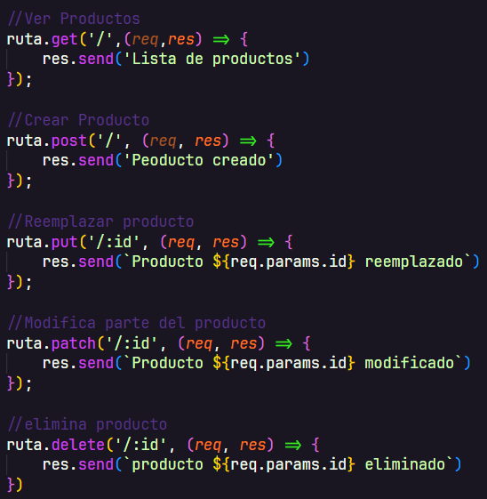
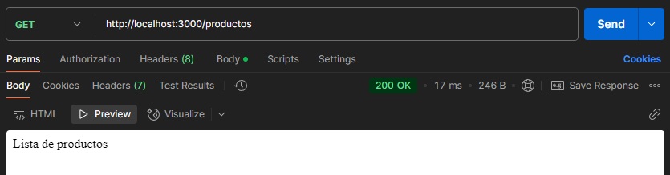
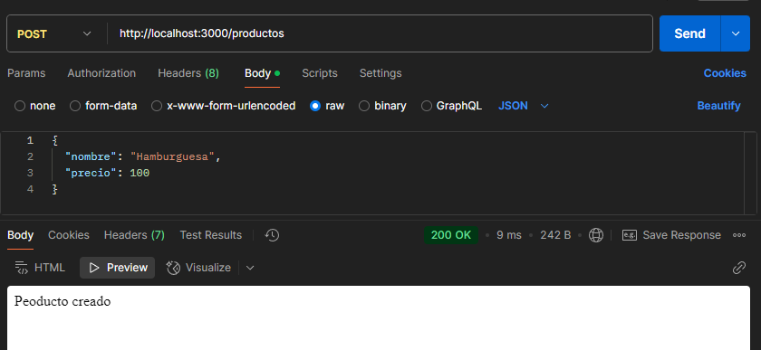
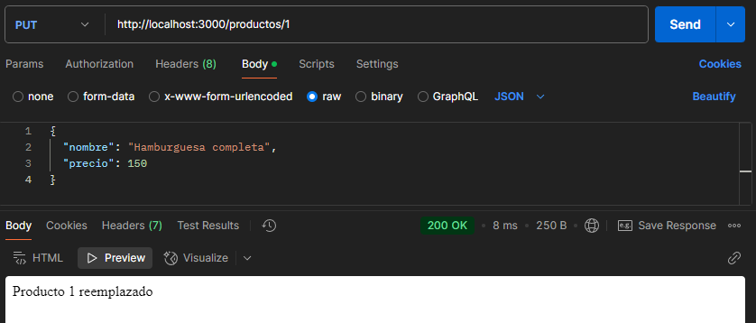
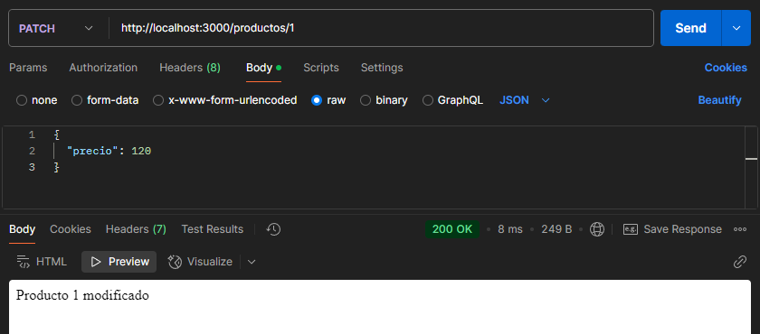
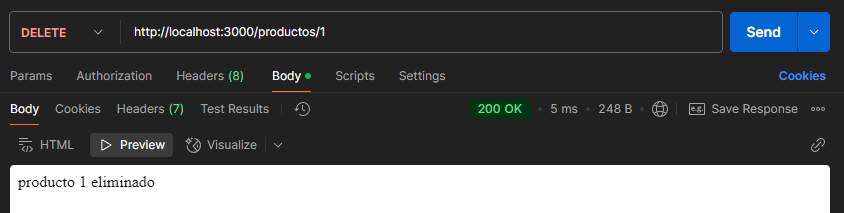

# Practica de peticiones HTTP 
## con el routes productos y postman

---

## definimos las rutas
en nuestro archivo productos.routes.js

---

## Probamos el metodo GET
La peticion GET se usa para obtener en este caso "ver los productos"

## Probamos el metodo POST
La peticion POST se usa para crear un producto con un JSON

## Probamos el metodo PUT
La peticion PUT se usa para reemplazar un producto entero atravez de la id

## Probamos el metodo PATCH
La peticion PATCH se usa para modificar un producto por su id y solo una parte del producto con un JSON

## Probamos el metodo DELETE
La peticion DELETE se usa para eliminar un producto por su id 
